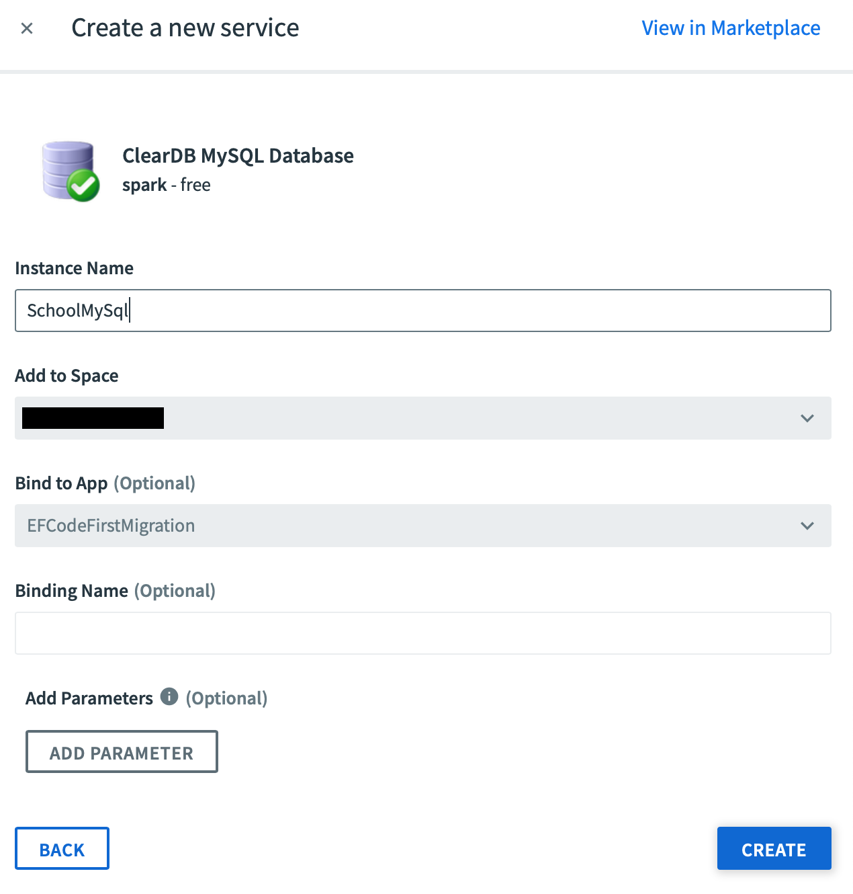
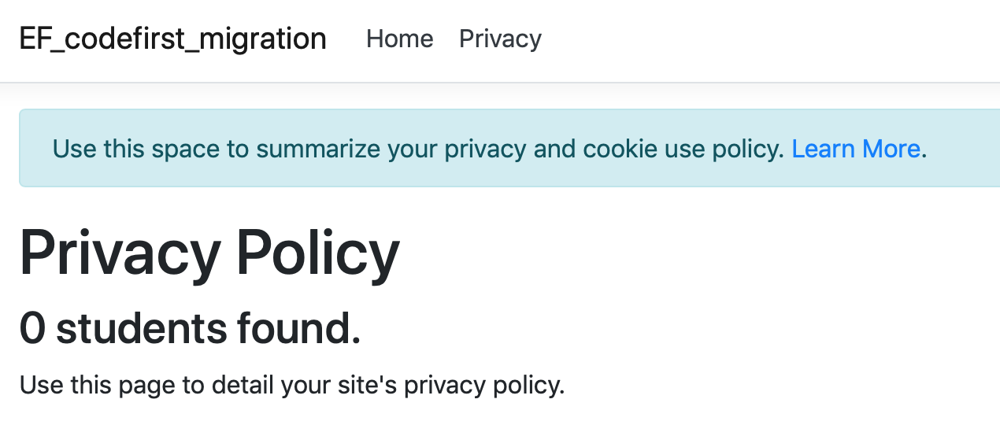

# CF-Web-templates
Cloud Foundry web templates

## EF Codefirst migration
Entity Framework code first migration template for Cloud Foundry.

### Running
1. cf push the web application
2. Open the website and go to the Privacy tab
3. Depending on the stage you're in you'll get a different result
   1. *first time*: message "no data", exception of missing mySql in CF logs > continue step 4 
   > MySql.Data.MySqlClient.MySqlException (0x80004005): Unable to connect to any of the specified MySQL hosts.
   2. *second time*: message "no data", exception of missing table in CF logs > continue step 6
   > MySql.Data.MySqlClient.MySqlException (0x80004005): Table 'ad_7da1a444e9b7c11.students' doesn't exist
   3. *third time*: message "0 students found" > continue step 7
4. In CloudFoundry add mySql from the marketplace to your web application

5. cf restart the web application to load the new environment variables - goto 2 expect 3-2
6. In CloudFoundry goto Tasks of you web application and run the command below - goto 2 expect 3-3
```
cd /home/vcap/deps/0/dotnet_publish && exec ./EF-codefirst-migration --update-database
```
7. EF Codefirst migration done - web application deployment complete



### Details
Every step is a new commit. You can replay these steps and check for the commit to validate your changes.
* dotnet new mvc:
```
dotnet new mvc
```
* School and student without datastore specifics:
> create folder Context with SchoolContext.cs and Student.cs. Make sure to add a constructor override in SchoolContext to provide the DbContextOptions for datastore selection.
* added nuget packages: *Pomelo in stead of MySql because of [issues](https://github.com/aspnet/EntityFrameworkCore/issues/11078)*
```
dotnet add package Microsoft.EntityFrameworkCore.Tools.DotNet
dotnet add package Pomelo.EntityFrameworkCore.MySql --version 2.1.4
dotnet add package Steeltoe.Extensions.Configuration.CloudFoundryCore
dotnet add package Steeltoe.CloudFoundry.ConnectorCore
```
* Cloud Foundry configuration to use mySql for datastore:
> Use the steeltoe nugets to get mysql information from CF configuration. Here the SchoolContext constructor override is used.
* Query datastore from privacy action 
* Add database migration commandline
* Add migration CreateSchoolDB
```
dotnet ef migrations add CreateSchoolDB
```
* Documentation


### Contributing
Create a commit on this branch and update this README.md explaining what happens. Then send me a pull-request ;)